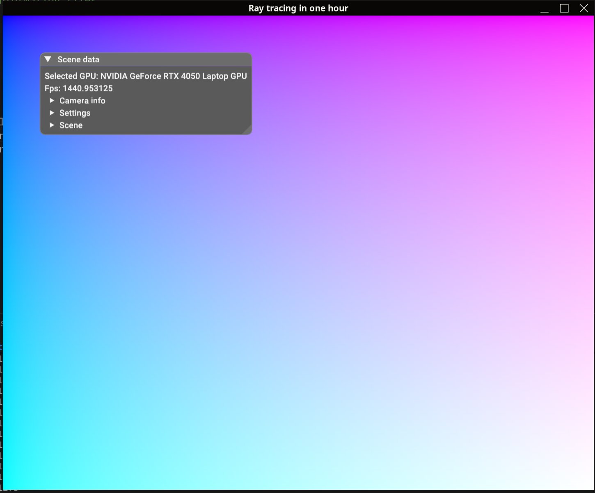

# Workshop: Ray Tracing in One Hour

In this workshop, you will implement a **non-physically based path tracer** that runs on your graphics card in real time.

The final result of the workshop should look similar to the image below:


While the path tracer will not be physically based, its implementation will include a proper **Monte Carlo estimator** to help evaluate the light transport equation.  
The provided starting code is written in a way that allows you to further expand on the material presented in the workshop. Possible extensions include:

- Adding new shapes
- Implementing physically correct specular reflections using different BRDFs
- Experimenting with advanced sampling or lighting models

---

## Building and Running the Program

Three requirements must be met before you can run the application:

1. Your GPU (either discrete or integrated) must support **Vulkan 1.3**.  
   → Read more [here](https://docs.vulkan.org/guide/latest/checking_for_support.html)
2. You must have **Python** installed.  
   → Verify by running `python -v` in your terminal.
3. You must download the **Slang compiler**.

---

## Getting Started

Create a folder anywhere on your computer — this will be the workspace where you store everything related to this workshop.

---

## Downloading the Slang Compiler

1. Download the Slang compiler for your operating system from the official [Slang release page](https://github.com/shader-slang/slang/releases/tag/v2025.21.2).
2. Extract the downloaded zip file, preferably to the same folder where you will later extract the workshop executables.

---

## Downloading the Workshop Executable

To run the application, you need to download the precompiled executables I have prepared for you.

1. Navigate to the [release page](https://github.com/wpsimon09/Ray-Tracing-In-One-Hour/releases/tag/v1.0) of this repository and download the `build-xxx` archive for your operating system.
2. Extract the downloaded zip file to the folder you created earlier.
3. Verify that the program is running correctly by double-clicking the executable `RaytracingInOneHour`, or by running one of the following commands in your terminal:

```bash
# For Linux
./RaytracingInOneHour

# For Windows
RaytracingInOneHour
```

Wait a bit, and then a window should open where you will see the following:



**That’s it!**

---

# Building from Source (for hardcore people)

For advanced users, you can also build this application from source.  
All libraries are statically linked and compiled from source, including the **Vulkan headers**.  
The project uses **Volk** to provide a lightweight and efficient Vulkan loader that automatically handles function pointer management and simplifies Vulkan initialization.

Building from source gives you full control over the renderering engine located in `RenderingEngine.h/cpp` including adding new UI elements or more advanced usage of Vulkan.

1. recursinvly clone the repo

```git bash
git clone https://github.com/wpsimon09/Ray-Tracing-In-One-Hour.git --recursive
```

2. create build folder

```bash
mkdir build
cd build
```

3. configure cmake

**Linux**

```bash
cmake .. -DCMAKE_BUILD_TYPE=Release
```

**Windows**

```bash
cmake .. -DCMAKE_TOOLCHAIN_FILE=../toolchain-windows.cmake -DCMAKE_BUILD_TYPE=Release
```

4. build

```bash
cmake --build . --config Release -j 14
```
